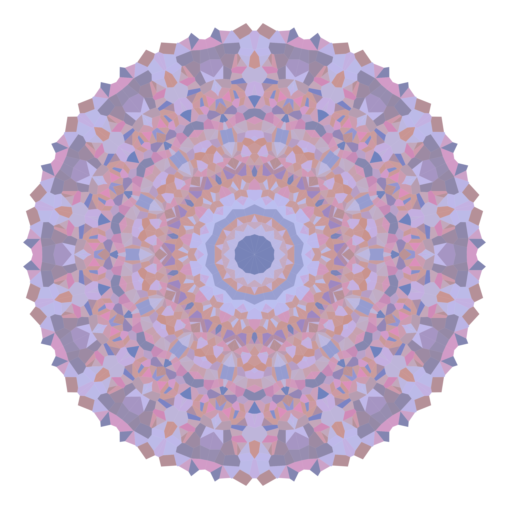

# Mandala

Inspired by mathematician A. Chinchón, creating generative art in R.

Brief explanation of making MANDALAs:

- Start obtaining n equidistant points in a unit circle centered in (0,0) 
- Repeat the process with all the points, obtaining new n points around each of them
- Discard the previous n points
- Repeat 1-3 iteratively a times, to obtain nª points
- Calculate Voronoi tesselation
- Graph using ggplot and colour using your own custom palettes

Complete explanation of the process can be found on my [website.](https://alishabhimani.ca/mandala/)

Here is an example of what you can do:

